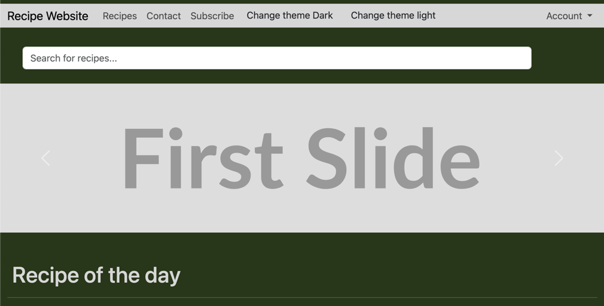
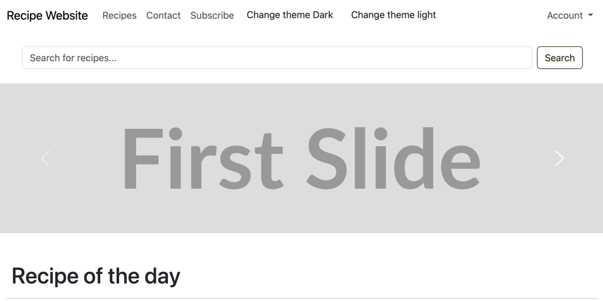

# САНКТ-ПЕТЕРБУРГСКИЙ НАЦИОНАЛЬНЫЙ ИССЛЕДОВАТЕЛЬСКИЙ УНИВЕРСИТЕТ ИТМО

## Дисциплина: фронтенд разработка

## Отчет

Домашняя работа 3

Выполнил: Самсонов Александр Александрович
К3343

Проверил: Добряков Д. И.

## Задача

Выполнить темизацию ранее реализованного сайта. Добавить к текущему варианту сайта
дополнительную тему, в итоге должно получиться либо: светлая и тёмная с ориентиром на
пользовательские настройки. Либо две кастомные темы с переключателем через JS.

## Ход работы

Я добавил 2 отдельных css файла, для того чтобы изменить цветовую палитру
веб-страницы. При помощи тега `media="(prefers-color-scheme: <light/dark>)"` я
автоматически применяю требуемую тему на страницу. Также я добавил кнопки с
селекторами тем из примера, чтобы было удобнее тестировать результат

**Темная тема**

**Светлая тема**

## Выводы

Я научился манипулировать цветовой палитрой bootstrap при помощи применения css
переменных, что позволило кастомизировать мою страницу.
