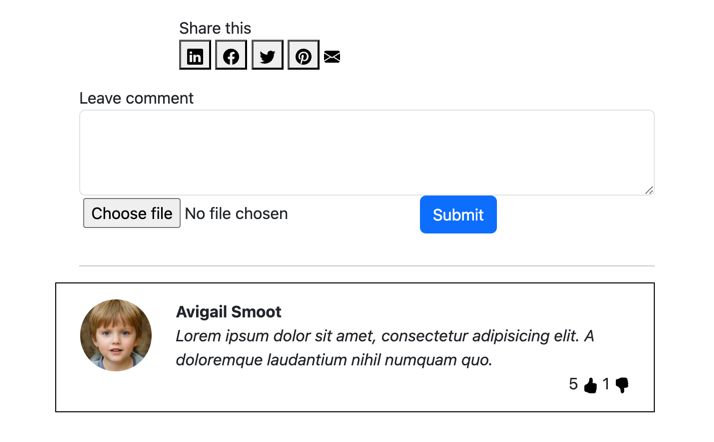

# САНКТ-ПЕТЕРБУРГСКИЙ НАЦИОНАЛЬНЫЙ ИССЛЕДОВАТЕЛЬСКИЙ УНИВЕРСИТЕТ ИТМО

## Дисциплина: фронтенд разработка

## Отчет

Домашняя/лабораторная работа 2

Выполнил: Самсонов Александр Александрович
К3343

Проверил: Добряков Д. И.

## Задача

Вынести все используемые ранее SVG-иконки в общий SVG-спрайт. Если иконок не было,
добавьте 3-5 иконок и поместите их в SVG-спрайт.

## Ход работы

Я завел отдельный блок с svg спрайтами и тегом `<sybmol>` сохранил требуемые для
данной страницы спрайты. Далее посредством следующего html кода я указал где и какие
svg спрайты необходимо отрендерить. В результате я вынес большие куски кода svg
спрайтов за пределы основного кода, что упростило его редактирование.

```html
<svg class="icon">
    <use xlink:href="#<sprite_name>"></use>
</svg>
```



## Выводы

Я научился использовать svg спрайты для упрощения создания новой разметки и потенциального ускорения скорости
загрузки (нет необходимости загружать одинаковые svg path's много раз).
