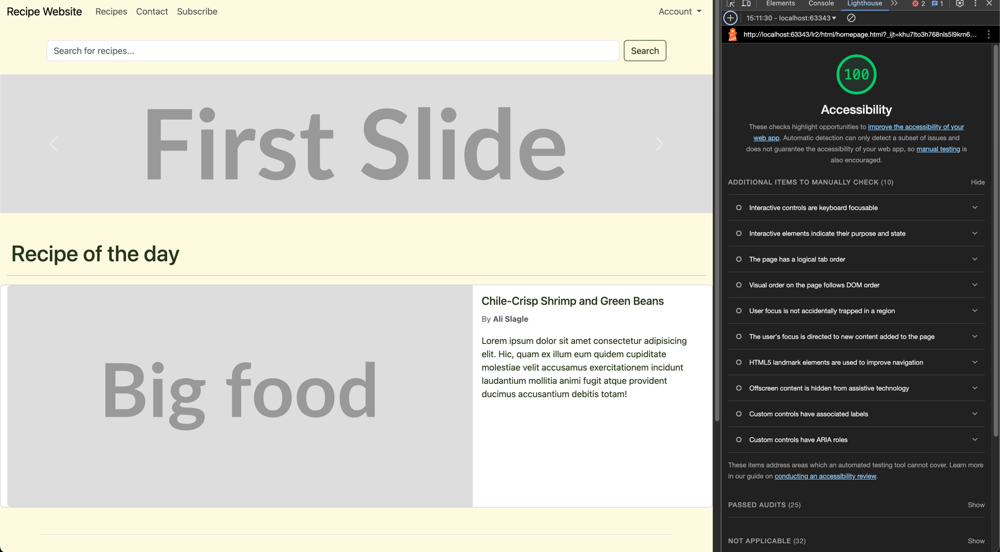
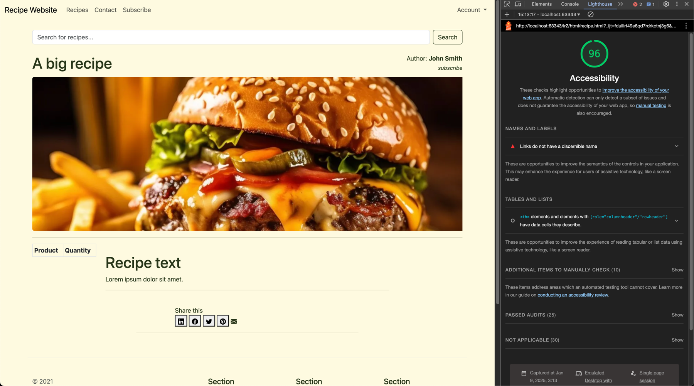

## САНКТ-ПЕТЕРБУРГСКИЙ НАЦИОНАЛЬНЫЙ ИССЛЕДОВАТЕЛЬСКИЙ УНИВЕРСИТЕТ ИТМО

# Дисциплина: фронтенд разработка

## Отчет

Домашняя/лабораторная работа 2

Выполнил: Самсонов Александр Александрович  
К3343

Проверил: Добряков Д. И.

# Задача

## Домашняя работа 2: доступность в HTML

Улучшить доступность ранее реализованного сайта. Добавить необходимые HTML-атрибуты ко
всему контенту на странице и проверить это с помощью инструментов из Dev Tools браузера
Firefox и сервиса Google Lighthouse.

## Лабораторная работа 2: взаимодействие с внешним API

Вам нужно привязать то, что Вы делали в ЛР1 к внешнему API средствами fetch/axios/xhr.

# Ход работы

## Домашняя работа

Я применил сервис Google Lighthouse и получил первоначальный замер качества своей
работы. По доступности я получил оценку 87 и набор рекомендаций по улучшению.

1) Необходимо добавить описательную информацию к кнопке search
2) Необходимо сменить цвета кнопки search для большей контрастности
3) Необходимо заменить тэги h5, так как перед ними не стоят теги h1-4

Я выполнил все рекомендации Google Lighthouse и получил рейтинг доступности 100.

**Главная страница**



**Страница рецепта**



## Лабораторная работа

Для реализации этого задания я нашел бесплатные api https://foodish-api.com/
и https://www.themealdb.com/api.php. Оба сервиса предоставляли доступ к информации о 
блюдах по запросу. На их основе я создал следующие функции:
```js
async function get_rand_img_url() {} // Даем ссылку на случайную фотографию еды
async function substitute_src(div_id) {} // Подменяет src во всех img внутри div_ic
async function get_recipe_description() {} // Возвращает json с случайным рецептом от themealdb
async function create_card_markup() {} // создавет строку с разметкой для карточки рецепта
async function insert_card(div_id, n_cards = 1) {} // создает n карточек и вставляет 
// их в нужный div
function get_table_entry(recipe_data, n_row) {} // создает ряд для таблицы состава рецепта
async function create_youtube_embed(youtube_link) {} // применяет api youtube чтобы 
// получить embed html
```

Далее я задал функцию main, которая определяет последовательность загрузки элементов 
на странице. Для уменьшения количества прыжков на экране у пользователя, я начал снизу 
и двигался наверх. Пока я не получил ответа от api, я подменяю картинки на 
плейсхолдеры c https://placehold.co/.


Затем я заменил api https://foodish-api.com/ на свой json-сервер, создал несколько 
записей и подменил url api на localhost:3000. Я подключил комментарии и аутентификацию 
и теперь динамически подменяю карточки комментариев в зависимости от ответа моего api. 

# Вывод

Таким образом я обновил свой проект, улучшил доступность для людей с особенными 
требованиями и наполнил информацией со сторонних api. Также я научился 
взаимодействовать с dom при помощи javascript, а также познакомился с сервисом 
json-server для быстрого mock'a api.
